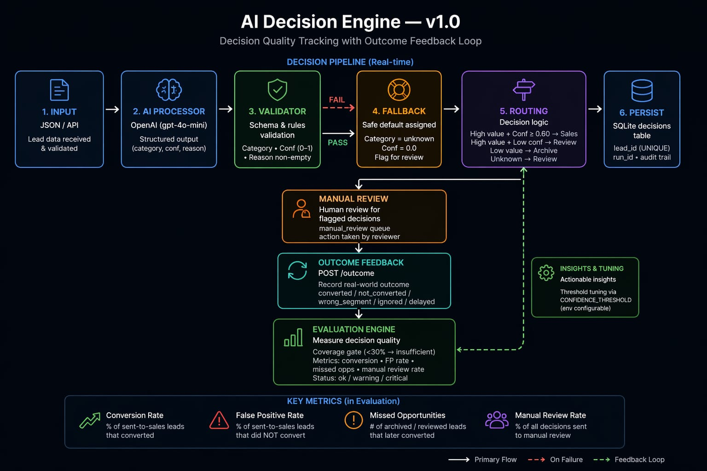

# AI Decision Engine (Feedback & Evaluation Loop) — v1.0

Most AI systems make decisions.  
Few systems know if those decisions were actually correct.

This system closes that gap.

**Type:** System design / AI evaluation pipeline  
**Use case:** AI-assisted decision-making (lead routing)  
**Core concept:** Decision → Outcome → Evaluation loop  

---

## Problem

Most AI lead-routing systems stop at classification.

They decide where a lead should go, but they do not measure whether that decision was actually right.

This creates silent failure: sales teams receive unqualified leads, real buyers are missed, and no system exists to detect or correct it.

---

## Solution

This system records the original decision, accepts the real-world outcome later, and evaluates decision quality over time.

---

## Outcome

Using a simulated 50-lead dataset with outcome feedback:

- 50 leads processed  
- 25 routed to sales  
- 14 archived  
- 11 sent to manual review  
- 32 outcomes recorded  
- 64% outcome coverage  
- 68% conversion rate on sent-to-sales leads  
- 32% false positive rate → roughly 1 in 3 leads sent to sales should not have been there  
- 4 missed opportunities detected → leads that would likely have been lost without feedback analysis  
- evaluator returned `warning` status with actionable issues  

This demonstrates a full feedback loop from AI decision to measured business result.

---

## Architecture



Decisions and outcomes are stored separately and evaluated asynchronously, allowing real-world feedback to be joined back to the original AI decision.

This system has two connected layers:

**1. Decision pipeline (real-time)**  
Input → AI → Validation → Fallback → Routing → Persist  

**2. Feedback loop (delayed)**  
Outcome → Evaluation → Insights → Threshold tuning  

Together, they measure whether AI decisions were actually correct.

---

## Why not just use rules?

Rules work on clean, predictable input.  
Lead qualification is not clean or predictable — it involves ambiguous intent, incomplete context, and uncertain value.

AI handles those cases.

This system adds the missing layer: measuring whether those AI-assisted decisions were actually right.

This is not just logging outcomes.  
It connects past decisions with future results and evaluates them under coverage constraints — something most AI pipelines never implement.

CRM reports show outcomes — not whether the AI decision was correct at the time it was made.

---

## Business value

| Component | What it prevents / enables |
|---|---|
| Validation | Blocks invalid AI output from becoming business decisions |
| Fallback | Prevents system failure on malformed AI responses |
| Routing | Converts AI output into clear operational actions |
| Persistence | Creates an audit trail for every decision |
| Outcome feedback | Records real-world results of each decision |
| Evaluation engine | Measures decision quality instead of guessing |
| Coverage gate | Prevents misleading metrics on insufficient data |
| Threshold tuning | Enables controlled optimisation of decision logic |

---

## Setup

Python 3.11+

```bash
pip install -r requirements.txt
cp env.example .env
```

The system runs in simulation mode without an `OPENAI_API_KEY`. To use a real model, add it to `.env`. See [`env.example`](env.example) for all available settings.

---

## Quick demo

### 1. Run batch pipeline

```bash
python main.py
```

### 2. Seed outcome feedback

```bash
python data/seed_outcomes.py
```

### 3. Start the API server

```bash
uvicorn api:app --reload --port 8000
```

### 4. Evaluate decision quality

```bash
curl http://localhost:8000/stats
```

Or open `http://localhost:8000/docs` and call `GET /stats` from the browser.

---

## API reference

Start the server with `uvicorn api:app --reload --port 8000`, then:

| Method | Endpoint | Purpose |
|--------|----------|---------|
| POST | `/qualify` | Process a lead through the decision pipeline |
| POST | `/outcome` | Record the real-world outcome for a decision |
| GET | `/stats` | Decision quality metrics, insights, and outcome breakdown |
| GET | `/audit` | Recent decisions with outcome status (default: last 20) |
| GET | `/health` | Health check — database connectivity and config |

Interactive docs: `http://localhost:8000/docs`

---

## Version Log

| Version | Date | Change |
|---|---|---|
| v1.0 | 2026-04-23 | Initial release — decision pipeline, feedback loop, API |
| v1.0 | 2026-04-24 | Added System Context section; clarified project title |
| v1.0 | 2026-06-15 – 2026-06-18 | Fixed README casing/formatting; corrected System Context references across all five engines |
| v1.0 | 2026-06-20 | Added outcome seeding script and demo sequence; fixed decision routing count; cleaned up low-severity audit items |
| v1.0 | 2026-07-04 | Adopted ARTIFACT_STANDARD Tier 0 — CLAUDE.md, pre-push validation, README restructure, first ADR |

---

## System Context

Part of a five-engine AI decision system:

- **[AI Reliability Engine](https://github.com/kobescak-kristian/ai-reliability-engine)** - prevents invalid AI outputs from entering workflows
- **AI Decision Engine** - tracks outcomes and evaluates whether decisions were correct *(this system)*
- **[AI Impact Scoring Engine](https://github.com/kobescak-kristian/ai-impact-scoring-engine)** - measures the financial impact of decisions and tunes thresholds
- **[AI Execution Engine](https://github.com/kobescak-kristian/ai-execution-engine)** - executes the workflow and recommends improvements
- **[AI Context Engine](https://github.com/kobescak-kristian/ai-context-engine)** - grounds decisions in retrieved precedent and explains them

Complete system: validation → evaluation → financial impact → grounded explanation → execution